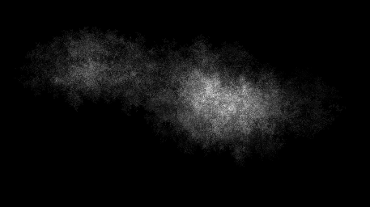
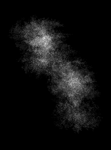
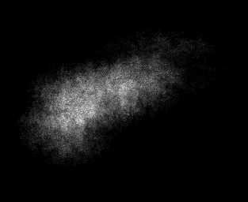
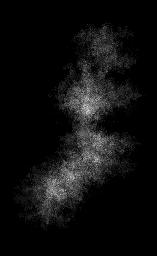

# Fracland
Fracland is a fractal generator that uses points on the edge of the mandelbrot set to render different julia sets,
and adds these together to generate a heightmap for an island.

  

## How does it work?

Fracland is a very simple concept following an unnessecary long number of steps:
1. Generate the Mandelbrot fractal.
2. Make an array of edges where the iterations on the mandelbrot is above a certain threshold.
3. Use these *edge-values* to generate an arbitrary  amount of Julia fractal sets and add these together to form one island.
4. Do this several times, using a random normal value for the size of the islands.
5. Add the islands together, starting from one island and following a random angle and moving with a random stepsize every time.
6. You've now generated some *special* islands.

## Sample islands

## TODO
* Rotation of island matrix
* Sample program for island view
* Package-ify